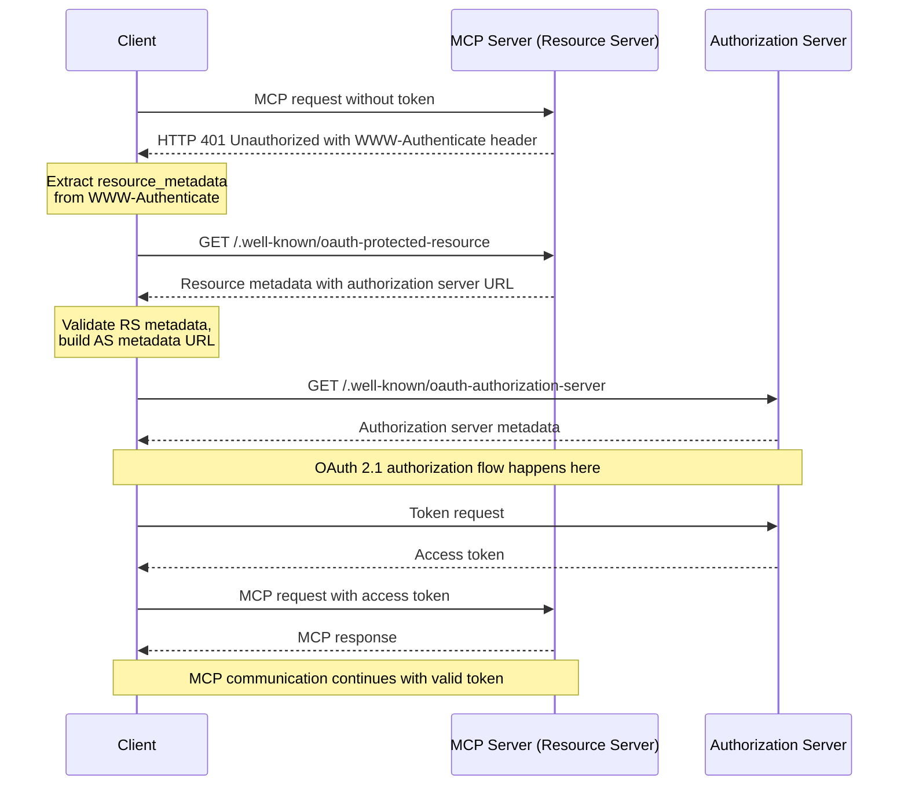

## Authorization Flow  授权流程

### 1. 背景(Background)

随着模型上下文协议 (Model Context Protocol, MCP) 的应用场景从本地环境扩展到开放的互联网，对服务进行访问控制和身份验证变得至关重要。这直接关系到 MCP Server 的核心安全性。当前，Pixiu 网关已经具备将后端 API 包装为 MCP Server 的能力，下一步的核心任务是利用网关的现有能力，集成一套标准的鉴权机制，以完整实现 MCP 规范中的授权 (Authorization) 要求。

MCP 规范明确指出：

	Implementations using an HTTP-based transport **SHOULD** conform to this specification.
	（基于 HTTP 的传输应该实现此规范。）

本方案旨在设计一个健壮、可扩展且符合行业最佳实践的授权流程。

### 2. 核心原则与角色定位 (Core Principles & Role)

#### 2.1 Pixiu 的角色抉择：资源服务器

> A protected _MCP server_ acts as an [OAuth 2.1 resource server](https://www.ietf.org/archive/id/draft-ietf-oauth-v2-1-13.html#name-roles), capable of accepting and responding to protected resource requests using access tokens.
> 
> The _authorization server_ is responsible for interacting with the user (if necessary) and issuing access tokens for use at the MCP server. The implementation details of the authorization server are beyond the scope of this specification. It may be hosted with the resource server or a separate entity. The [Authorization Server Discovery section](https://modelcontextprotocol.io/specification/2025-06-18/basic/authorization#authorization-server-discovery) specifies how an MCP server indicates the location of its corresponding authorization server to a client.

受保护的 MCP 服务器充当 OAuth 2.1 资源服务器，能够使用访问令牌接受和响应受保护的资源请求。

授权服务器负责与用户交互（如有必要）并颁发供 MCP 服务器使用的访问令牌。授权服务器的实现细节超出了本规范的范围。它可以与资源服务器一起托管，也可以作为单独的实体托管。指定 MCP 服务器如何向客户端指示其相应授权服务器的位置。

对于 Pixiu 网关而言，其核心职责是保护后端的 API 服务，因此我觉得包装成 Resource Server 是更好且正确的选择。

| 方案                 | 优点                                                  | 缺点                                          |
| :----------------- | :-------------------------------------------------- | :------------------------------------------ |
| 网关只作资源服务器 (推荐)     | 架构清晰，职责单一。 安全性高，依赖专业方案。 灵活，可扩展性强。 符合行业最佳实践 | 需要额外部署/购买一个授权服务器                            |
| 网关 = 资源服务器 + 授权服务器 | 表面上看起来组件少，部署简单                                      | 架构混乱，高耦合。 极高的安全风险。 难以维护和扩展。 缺乏互操作性 |

#### 2.2. 授权流程概览

### 3. 约束与目标(Constraints & Goals)

#### 3.1 功能约束

MCP servers **MUST** implement OAuth 2.0 Protected Resource Metadata ([RFC9728](https://datatracker.ietf.org/doc/html/rfc9728)). MCP clients **MUST** use OAuth 2.0 Protected Resource Metadata for authorization server discovery.

Pixiu 作为 MCP Server 需要保护资源元数据。

Implementors should note that Protected Resource Metadata documents can define multiple authorization servers. The responsibility for selecting which authorization server to use lies with the MCP client, following the guidelines specified in [RFC9728 Section 7.6 “Authorization Servers”](https://datatracker.ietf.org/doc/html/rfc9728#name-authorization-servers).  
Pixiu 应该支持多个授权服务器的选择，选择权在于 MCP Client。

MCP servers **MUST** use the HTTP header `WWW-Authenticate` when returning a _401 Unauthorized_ to indicate the location of the resource server metadata URL as described in [RFC9728 Section 5.1 “WWW-Authenticate Response”](https://datatracker.ietf.org/doc/html/rfc9728#name-www-authenticate-response).

Pixiu 在返回 401 的时候，需要通过 `WWW-Authenticate` 指示资源服务器的元数据 URL。

MCP servers, acting in their role as an OAuth 2.1 resource server, **MUST** validate access tokens as described in [OAuth 2.1 Section 5.2](https://datatracker.ietf.org/doc/html/draft-ietf-oauth-v2-1-13#section-5.2). MCP servers **MUST** validate that access tokens were issued specifically for them as the intended audience, according to [RFC 8707 Section 2](https://www.rfc-editor.org/rfc/rfc8707.html#section-2). If validation fails, servers **MUST** respond according to [OAuth 2.1 Section 5.3](https://datatracker.ietf.org/doc/html/draft-ietf-oauth-v2-1-13#section-5.3) error handling requirements. Invalid or expired tokens **MUST** receive a HTTP 401 response.

Pixiu 需要验证访问令牌是否专门为其目标用户颁发。无效或过期的令牌**必须**收到 HTTP 401 响应。

- **`HTTP 401 Unauthorized`**: 用于**认证失败**，即客户端没有提供令牌、令牌无效、过期或签名错误。`WWW-Authenticate` 头应该如你所述被包含。
    
- **`HTTP 403 Forbidden`**: 用于**授权失败**，即客户端提供了有效的令牌，但该令牌所拥有的权限（如 `scope`）不足以执行当前请求的操作。在这种情况下，服务器已经知道了用户的身份，但拒绝其访问。

Token Audience Binding and Validation: MCP servers **MUST** validate that tokens presented to them were specifically issued for their use

Pixiu **必须**验证提供给它们的令牌是否是专门为其使用的。

#### 3.2 安全约束

**杜绝硬编码密钥**: 严禁在代码或配置中硬编码任何对称密钥或私钥。公钥应通过标准的 `jwks_uri` 动态获取。

**核心声明验证**: 必须强制验证令牌的 `iss` (Issuer), `aud` (Audience), `exp` (Expiration Time) 声明。

**缓存安全**: 元数据和公钥的缓存必须有明确的过期策略 (TTL)，以响应密钥轮换等安全事件。
