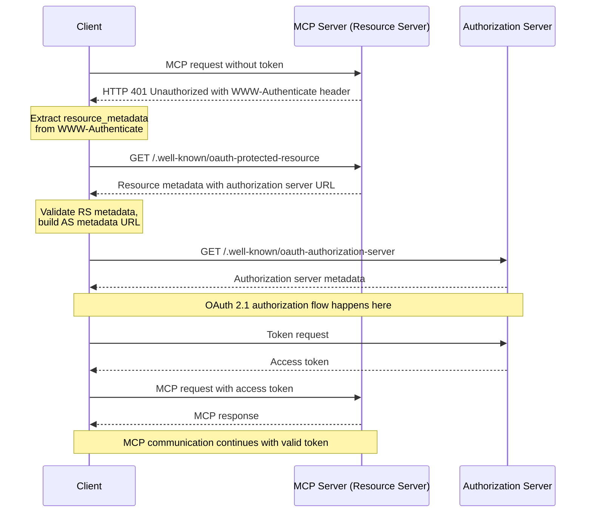

##   Authorization Flow  授权流程

### 背景

由于 MCP 服务不仅局限于本地，而是在互联网上进行更大范围的使用，所以鉴权是很有意义且有必要的一件事，这关乎到 MCP Server 的安全性。目前在 Pixiu 网关中已经实现了将后端 API 包装成 MCP Server ，现在需要做的是利用网关本身的能力集成鉴权功能，实现 MCP 协议中的 Authorization 部分。

Implementations using an HTTP-based transport **SHOULD** conform to this specification.
基于 HTTP 的传输应该实现此规范。

#### MCP 授权

> A protected _MCP server_ acts as an [OAuth 2.1 resource server](https://www.ietf.org/archive/id/draft-ietf-oauth-v2-1-13.html#name-roles), capable of accepting and responding to protected resource requests using access tokens.
> 
> The _authorization server_ is responsible for interacting with the user (if necessary) and issuing access tokens for use at the MCP server. The implementation details of the authorization server are beyond the scope of this specification. It may be hosted with the resource server or a separate entity. The [Authorization Server Discovery section](https://modelcontextprotocol.io/specification/2025-06-18/basic/authorization#authorization-server-discovery) specifies how an MCP server indicates the location of its corresponding authorization server to a client.

受保护的 MCP 服务器充当 OAuth 2.1 资源服务器，能够使用访问令牌接受和响应受保护的资源请求。

授权服务器负责与用户交互（如有必要）并颁发供 MCP 服务器使用的访问令牌。授权服务器的实现细节超出了本规范的范围。它可以与资源服务器一起托管，也可以作为单独的实体托管。指定 MCP 服务器如何向客户端指示其相应授权服务器的位置。

对于Pixiu 网关而言，我觉得只做单独的 Resource Server 是更好且正确的选择。

Pixiu 网关既然是将后端 API 暴露成 MCP Server，理应承担相应的职责。

考虑 Pixiu 职责承担：资源服务器 or 资源服务器加授权服务器

| 方案                 | 优点                                                  | 缺点                                          | 推荐度          |
| ------------------ | --------------------------------------------------- | ------------------------------------------- | ------------ |
| 网关只作资源服务器 (推荐)     | 架构清晰，职责单一。 安全性高，依赖专业方案。 灵活，可扩展性强。 符合行业最佳实践 | 需要额外部署/购买一个授权服务器                            | ⭐⭐⭐⭐⭐ (强烈推荐) |
| 网关 = 资源服务器 + 授权服务器 | 表面上看起来组件少，部署简单                                      | 架构混乱，高耦合。 极高的安全风险。 难以维护和扩展。 缺乏互操作性 | ⭐ (强烈不推荐)    |

The following diagram outlines an example flow:

