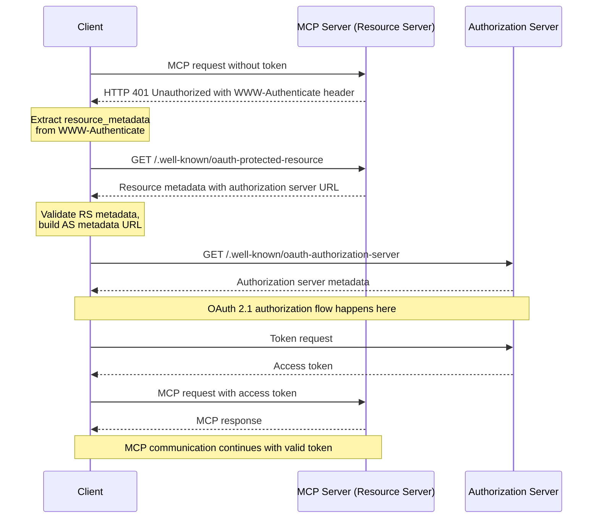

##   Authorization Flow  授权流程

### Roles

A protected _MCP server_ acts as an [OAuth 2.1 resource server](https://www.ietf.org/archive/id/draft-ietf-oauth-v2-1-13.html#name-roles), capable of accepting and responding to protected resource requests using access tokens.

受保护的 MCP 服务器充当 [OAuth 2.1 资源服务器](https://www.ietf.org/archive/id/draft-ietf-oauth-v2-1-13.html#name-roles) ，能够使用访问令牌接受和响应受保护的资源请求。

Pixiu 网关既然是将后端 API 暴露成 MCP Server，理应承担相应的职责。

考虑 Pixiu 职责承担：资源服务器 or 资源服务器加授权服务器

| 方案                 | 优点                                                  | 缺点                                          | 推荐度          |
| ------------------ | --------------------------------------------------- | ------------------------------------------- | ------------ |
| 网关只作资源服务器 (推荐)     | 架构清晰，职责单一。 安全性高，依赖专业方案。 灵活，可扩展性强。 符合行业最佳实践 | 需要额外部署/购买一个授权服务器                            | ⭐⭐⭐⭐⭐ (强烈推荐) |
| 网关 = 资源服务器 + 授权服务器 | 表面上看起来组件少，部署简单                                      | 架构混乱，高耦合。 极高的安全风险。 难以维护和扩展。 缺乏互操作性 | ⭐ (强烈不推荐)    |

