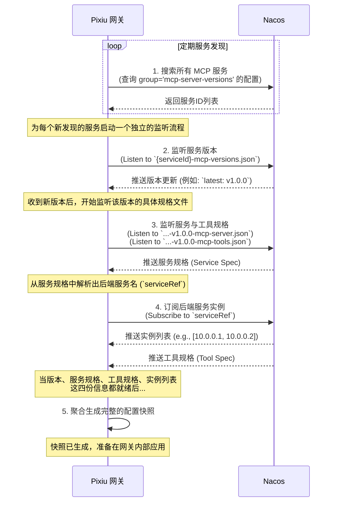

## 概述

本文档描述了 Dubbo-go-pixiu 中 MCP Server 与 Nacos 集成的设计方案，实现动态配置管理和服务发现能力。该方案通过扩展 pkg/remote 模块提供统一的远程通信抽象，并在 pkg/adapter 层创建 mcpserver 适配器来实现配置的动态转换和生命周期管理。

## 架构背景

### 现有架构问题

当前dubbo-go-pixiu存在以下架构不一致性：

1. **分散的Nacos客户端实现**

- `pkg/remote/nacos/client.go`: 服务发现客户端（naming_client.INamingClient）

- `configcenter/nacos_load.go`: 配置管理客户端（config_client.IConfigClient）

- 两套独立实现导致代码重复和维护困难

2. **静态MCP Server配置**

- 当前`pkg/filter/mcp/mcpserver`只支持静态配置的工具

- 无法动态响应Nacos配置变化

- 缺乏与远程配置中心的集成能力

3. **缺乏统一抽象**

-  `pkg/remote` 缺乏配置管理能力

-  `configcenter` 与 `pkg/remote` 职责重叠

- 没有统一的远程存储通信抽象

### 目标架构

建立清晰的三层架构：

1. **pkg/remote**: 统一远程存储通信抽象层

2. **pkg/adapter**: 配置转换和生命周期管理层

3. **pkg/filter**: 协议处理层

### 动态配置发现流程

本节流程图聚焦于**配置发现的逻辑**，阐述了网关如何从 Nacos 中一步步发现并聚合一个完整 MCP 服务所需的全部信息。

## 设计方案

### 1. 统一远程客户端抽象 (`pkg/remote`)  

本层负责**屏蔽底层具体远程存储（如 Nacos、etcd）的实现差异**，为上层提供一个稳定、统一的交互接口。

#### 1.1 核心接口定义

我们将定义一个核心的 `RemoteClient` 接口，它通过组合另外两个接口来获得所需的能力。  

* **`RemoteClient` 接口**:

* **组合能力**: 它将内嵌 `ServiceDiscovery` 和 `ConfigManagement` 两个接口。

* **生命周期管理**:

* `Start() error`: 启动客户端，建立与远程服务的连接。

* `Stop() error`: 关闭客户端，释放所有资源。

* **`ServiceDiscovery` 接口**: 负责服务发现相关的所有操作。

* **方法**:

* `SelectInstances(serviceName string) ([]Instance, error)`: 根据服务名查询所有健康的服务实例列表。`Instance` 是一个我们自己定义的、与具体实现无关的结构体，包含 IP、端口、元数据等信息。

* `Subscribe(serviceName string, callback func([]Instance)) error`: 订阅一个服务的实例变化。当实例列表发生变更时，将异步调用传入的 `callback` 函数。

* `Unsubscribe(serviceName string) error`: 取消对某个服务的订阅。

* **`ConfigManagement` 接口**: 负责配置管理相关的所有操作。

* **方法**:

* `GetConfig(dataId, group string) (string, error)`: 根据 `dataId` 和 `group` 获取一份配置，返回其原始内容（字符串）。

* `ListenConfig(dataId, group string, callback func(string)) error`: 监听一份配置的变更。当内容发生变化时，将异步调用传入的 `callback` 函数。

* `StopListen(dataId, group string) error`: 取消对某份配置的监听。

#### 1.2 Nacos 客户端实现 (`UnifiedNacosClient`)

这是 `RemoteClient` 接口在 Nacos 场景下的具体实现。

* **结构**: `UnifiedNacosClient` 是一个结构体 (struct)。

* **核心字段**:

* `namingClient`: 持有一个 Nacos 官方的 `naming_client.INamingClient` 实例。

* `configClient`: 持有一个 Nacos 官方的 `config_client.IConfigClient` 实例。

* `config`: 保存用于初始化这两个客户端的配置信息。

* **职责**:

* 实现 `RemoteClient` 接口的所有方法。

* 其方法的内部逻辑非常简单：将调用**代理 (delegate)** 给内部持有的 `namingClient` 或 `configClient` 去完成实际工作，并对返回结果进行必要的格式转换，使其符合我们自己定义的 `Instance` 等中立结构。

### 2. MCP Server 适配器 (`pkg/adapter/mcpserver`)

本层是连接**远程数据源**和**网关核心业务逻辑**的桥梁，负责将从 `pkg/remote` 获取的原始配置数据，转化为网关内部可以消费的业务对象。

#### 2.1 适配器核心 (`MCPServerAdapter`)

* **结构**: `MCPServerAdapter` 是一个结构体。

##### 核心字段:

* `remoteClient`: 持有一个 `remote.RemoteClient` 接口实例，它不知道底层是 Nacos 还是其他实现。

* `dynamicRegistry`: 持有一个指向 `DynamicToolRegistry` 的指针，用于将最终的工具配置更新到 MCP 过滤器中。

* `listeners`: 一个 `map`，用于管理所有 `ConfigListener` 实例，方便启停。

##### 职责:

* **初始化**: 通过 `Apply(config)` 方法接收配置，并创建出 `remoteClient` 实例。

* **启动**: `Start()` 方法会启动一个发现循环，扫描 Nacos 中所有需要处理的 MCP 服务，并为每个服务创建一个 `ConfigListener`。

* **停止**: `Stop()` 方法会优雅地停止所有的 `ConfigListener`，并关闭 `remoteClient`。

* **处理变更**: 提供一个内部方法（如 `onConfigUpdate`），供 `ConfigListener` 回调。当收到更新时，它会调用 `ConfigConverter` 进行转换，并将转换后的结果应用到 `DynamicToolRegistry`、`RouterManager` 和 `ClusterManager`。

#### 2.2 配置监听器 (`ConfigListener`)

* **结构**: `ConfigListener` 是一个结构体，每个实例负责一个 MCP 服务的完整监听。

##### 核心字段:

* `serviceId`: 标识自己正在监听哪个 MCP 服务。

* `adapter`: 一个指回 `MCPServerAdapter` 的指针，用于回调。

* `stopChan`: 一个 channel，用于接收停止信号。

##### 职责:

* 封装**级联监听**的复杂业务流程。在其 `watch()` 方法中，它会：

1. 首先使用 `remoteClient.ListenConfig` 监听“版本文件”。

2. 在版本的回调中，取消旧监听，并创建对新的“服务规格”和“工具规格”文件的监听。

3. 在服务规格的回调中，使用 `remoteClient.Subscribe` 订阅后端服务的实例列表。

* 当所有相关配置（版本、规格、实例）都获取到或发生变化时，将这些零散的信息**聚合成一个完整的配置快照**，然后调用 `adapter.onConfigUpdate` 方法，将快照传递出去。

#### 2.3 配置转换器 (`ConfigConverter`)

* **结构**: `ConfigConverter` 是一个**无状态**的工具类结构体，只包含方法。

##### 职责: 

负责数据模型的转换。

##### 核心方法:

* `ConvertToInternalModels(snapshot AggregatedConfig) (*InternalModels, error)`:

* 接收 `ConfigListener` 聚合好的配置快照 `AggregatedConfig`。

* 将快照中的各类 JSON/YAML 字符串，解析并转换为网关内部的强类型业务对象，如 `[]mcpserver.Tool`、`model.Router`、`model.Cluster`。

* 将这些转换好的对象打包成 `InternalModels` 结构体返回。

### 3. 集成点设计

#### 3.1 与 MCP Filter 集成 (`DynamicToolRegistry`)

**目标**: 让 MCP 过滤器能动态地感知工具的变化。

**实现**:

* 我们将改造现有的 `ToolRegistry`，使其成为 `DynamicToolRegistry`。

* 它将提供一个**线程安全**的方法：`UpdateTools(adapterId string, tools []mcpserver.Tool)`。

* `MCPServerAdapter` 在转换出新的工具列表后，会调用此方法。`DynamicToolRegistry` 内部会使用读写锁 (`sync.RWMutex`) 来安全地替换内存中的工具列表。

#### 3.2 路由与集群管理集成

**目标**: 动态地创建、更新或删除与 MCP 工具相关的路由和后端集群。

**实现**:

* `MCPServerAdapter` 在调用 `ConfigConverter` 得到 `model.Router` 和 `model.Cluster` 对象后，将直接调用网关全局的管理器：

* `server.GetRouterManager().AddRouter(router)`

* `server.GetClusterManager().SetCluster(cluster)`

* 这些管理器已经具备了处理动态更新的能力，我们只需将正确的配置喂给它们即可。