## Review Update Route Mechanism

PR 链接： https://github.com/apache/dubbo-go-pixiu/pull/777

社区的小伙伴重构了 Pixiu 的路由模块，遂进行读取瞻仰，希望能有所收获，

### RouteSnapshot 

#### 路由存储策略

核心结构体 `RouteSnapshot` 将路由规则分为了**两大阵营**，以应对不同的匹配需求：

##### 1. 基于路径的路由 (`MethodTries`)

- **数据结构**：`map[string]*trie.Trie`
	
- **存储逻辑**：
	
    - **第一层（分流）**：使用 Map 按 **HTTP 方法**（GET, POST, PUT...）分类。
        
    - **第二层（匹配）**：每个方法对应一棵 **前缀树 (Trie)**。
        
- **设计优势**：
    
    - **查询快**：Trie 树查询复杂度仅与路径长度相关，适合海量 URL。
		
	- **空间省**：公共前缀（如 `/api/v1/`）只存储一次。
		
	- **逻辑简**：先锁定方法再查树，树节点内无需再判断 HTTP 方法。
	
- **入选条件**：只要配置了 `Path`（精确路径）或 `Prefix`（前缀路径），无论是否包含 Header，都存入这里。

##### 2. 纯 Header 路由 (`HeaderOnly`)

- **数据结构**：`[]HeaderRoute` (切片/列表)

- **存储逻辑**：简单列表，匹配时需要遍历。

- **设计原因**：Header 是键值对，没有路径那样的层级关系（Hierarchy），无法构建 Trie 树，只能线性存储。

- **入选条件**：**必须同时满足** `Path` 为空 **且** `Prefix` 为空。即“不看路径，只看 Header”的特殊路由。

##### 3. 架构示意图 (Mermaid)

``` mermaid
graph TD
    subgraph RouteSnapshot [路由快照核心结构]
        direction TB
        
        RS[RouteSnapshot] -->|1. 路径路由| MT[MethodTries map]
        RS -->|2. 无路径路由| HO[HeaderOnly slice]
        
        subgraph Tries [MethodTries: 空间换时间]
            MT -->|key: GET| TrieGET[GET 前缀树]
            MT -->|key: POST| TriePOST[POST 前缀树]
            
            TrieGET --> Node1((/api))
            Node1 --> Node2((/user))
            Node1 --> Node3((/order))
        end
        
        subgraph List [HeaderOnly: 线性遍历]
            HO --> Rule1[规则A: Headers包含 version=v1]
            HO --> Rule2[规则B: Headers包含 token=xyz]
        end
    end
```



#### 高并发配置更新机制对比

**场景背景**：网关路由表（RouteSnapshot）。 **场景特征**：**读多写少**（每秒数万次读取，几小时一次更新）。 **核心目标**：在更新配置时，不能让正在处理的用户请求卡顿（Zero Downtime）。

|**特性**|**sync.RWMutex (读写锁) 🔒**|**atomic.Pointer (原子指针) ⚡**|
|---|---|---|
|**工作原理**|**交通红绿灯**。写锁开启时，读锁必须等待；反之亦然。|**瞬间幻影移形**。直接替换指向数据的指针，新旧数据在内存中同时存在。|
|**读操作体验**|**可能阻塞**。如果刚好赶上更新，请求必须排队等待锁释放。|**永不阻塞**。永远能拿到一个完整的快照（要么是旧的，要么是新的）。|
|**写操作影响**|**"Stop the World"**。写操作期间，所有读操作暂停。容易造成**延迟毛刺 (Latency Spike)**。|**无感切换**。写操作只是一个 CPU 指令级的指针交换，耗时极短，不影响读操作。|
|**适用场景**|读写频率相当，或者需要严格的数据实时一致性。|**读多写少**，且允许极短暂的数据版本共存（几纳秒的差异）。|

所以 Pixiu 选取 `atomic.Pointer` 来进行配置更新

```go
type SnapshotHolder struct {  
    ptr atomic.Pointer[RouteSnapshot]  
}  
  
func (h *SnapshotHolder) Load() *RouteSnapshot   { return h.ptr.Load() }  
func (h *SnapshotHolder) Store(s *RouteSnapshot) { h.ptr.Store(s) }
```

#### sync.Pool

用来缓解 GC 压力的方式，用就拿，用完就回收，不需要 GC 进行回收。

虽然标准库没有糖，但自从 Go 1.18 引入泛型后，开发者们通常会自己写一个包装器（Wrapper），让它变得像有语法糖一样**类型安全**，不用每次都写 `.(*Type)`。

**这种写法在很多现代 Go 项目中很流行，可以学一下：**

```go
// 定义一个带泛型的 Pool
type GenericPool[T any] struct {
    pool sync.Pool
}

// 封装 New 函数
func NewPool[T any](newFunc func() T) *GenericPool[T] {
    return &GenericPool[T]{
        pool: sync.Pool{
            New: func() any { return newFunc() },
        },
    }
}

// 封装 Get：自动帮你转类型！这就算是“人工语法糖”
func (p *GenericPool[T]) Get() T {
    return p.pool.Get().(T)
}

// 封装 Put
func (p *GenericPool[T]) Put(x T) {
    p.pool.Put(x)
}

// --- 使用起来就甜了 ---
// 1. 创建时指定类型
var myPool = NewPool(func() *[]int { 
    s := make([]int, 0, 10)
    return &s 
})

// 2. 使用时不需要断言了！直接拿到就是 *[]int
mySlice := myPool.Get()
```

#### sync.Map

我们可以把 `sync.Map` 理解为 Go 语言为了解决特定并发瓶颈而设计的一种“特种武器”。我们都知道，Go 原生的 `map` 是不具备并发安全性的，如果多个协程同时读写，程序会直接崩溃。通常我们的第一反应是给它加一把 `sync.RWMutex`（读写锁），这在大多数情况下都工作得很好。但是，当并发量极高，且拥有成千上万个核心都在疯狂读取同一个 Map 时，即便是读锁（RLock）也会因为竞争 CPU 缓存线而导致性能下降。这时候，`sync.Map` 就登场了。

`sync.Map` 能够实现极高性能读取的秘密，在于它采用了一种“读写分离”的架构策略。它在内部维护了两份数据：一份是只读的 Read Map，另一份是包含全量数据的 Dirty Map。这就好比一家繁忙的酒店，Read Map 是前台的“贵宾名单”，前台服务员手里都有一份副本，查看时不需要排队（无锁原子操作），速度极快；而 Dirty Map 则是后台的“总档案室”，那里数据最全，但每次进去查都要申请钥匙（加锁）。

当一个读请求进来时，它会优先去查无锁的 Read Map，只有当这里查不到时，才会通过加锁的方式去 Dirty Map 里查找。更有趣的是，它内部有一个“晋升机制”：如果系统发现去 Dirty Map 查数据的次数太多了，说明这些数据很热，它就会把 Dirty Map 直接升级替换成 Read Map。这种机制保证了那些频繁访问的数据最终都会停留在无锁的快速通道里。

在使用上，`sync.Map` 和普通 map 最大的区别在于它是“弱类型”的。它的 Key 和 Value 都是 `any`（即 `interface{}`）类型，这意味着我们存取时不需要指定类型，但取出来使用时必须进行类型断言。下面是一段基础的操作演示：

```go
package main

import (
    "fmt"
    "sync"
)

func main() {
    var m sync.Map

    // 写入数据非常简单，直接 Store 即可，不需要关心锁
    m.Store("user_1", "Gemini")
    m.Store("user_2", "Claude")

    // 读取数据时，Load 返回两个值：value 和是否存在的布尔值
    // 注意：取出来的 value 是 any 类型，必须断言成 string 才能当字符串用
    if v, ok := m.Load("user_1"); ok {
        fmt.Println("Found user:", v.(string))
    }

    // 删除也是原子操作
    m.Delete("user_2")
}
```

在这些 API 中，最值得我们深入理解的是 `LoadOrStore` 方法。在并发编程中，我们经常遇到“如果缓存里没有，就计算并存进去”的需求。如果我们自己写 `if !exist { map[k] = v }`，在这两行代码之间可能会有别的协程插队修改数据，从而导致数据覆盖。`LoadOrStore` 完美地解决了这个问题，它将“检查”和“写入”合并成了一个不可分割的原子动作。这在实现像正则缓存这样的功能时非常关键：

```go
// 假设这是一个正则缓存场景
func getOrCompileRegexp(m *sync.Map, pattern string) *regexp.Regexp {
    // LoadOrStore 尝试读取。
    // 如果 pattern 已存在，loaded 为 true，actual 返回旧值。
    // 如果 pattern 不存在，它会把新编译的正则存进去，loaded 为 false，actual 返回新值。
    newRe := regexp.MustCompile(pattern)
    actual, loaded := m.LoadOrStore(pattern, newRe)

    if loaded {
        fmt.Println("直接复用缓存里的正则对象")
    } else {
        fmt.Println("缓存未命中，已存入新对象")
    }
    
    return actual.(*regexp.Regexp)
}
```

最后需要格外注意的是，`sync.Map` 并不是万能药。官方文档很明确地指出，它主要是为了优化“读多写少”或者“写操作不重叠”的场景。比如我们在网关代码里看到的正则缓存，一旦编译存入后几乎全是读取，这就是 `sync.Map` 的舒适区。但如果你面临的是一个读写都很频繁，且经常更新同一个 Key 的业务场景，普通的 `map` 配合 `RWMutex` 往往会有更好的性能表现，因为 `sync.Map` 在写入时涉及到的两层 Map 维护和数据迁移反而会带来额外的开销。

### Router 高性能网关路由系统设计

在设计一个承载高并发流量的网关（Gateway）路由系统时，最核心的挑战在于如何处理“极高频的读请求”与“低频但必要的配置更新”之间的矛盾。

该 PR 摒弃了传统的读写锁（RWMutex）方案，转而采用 **Read-Copy-Update (RCU)** 模式配合 **分片 Trie 树** 结构，实现了热点路径的无锁化与零内存分配。

#### 并发模型：基于快照的 RCU 机制

在网关场景下，读写比极高（可能达到 10000:1 甚至更高）。使用标准的互斥锁即便是在读多写少的场景下，频繁的锁竞争（Lock Contention）也会导致 CPU 缓存抖动，严重拖累吞吐量。

重构采用了 **RCU (Read-Copy-Update)** 结合 **COW (Copy-On-Write)** 的策略。其核心思想是：**读操作永远不等待写操作，写操作永远不阻塞读操作**。系统维护一个指向路由配置快照（Snapshot）的原子指针 (`atomic.Pointer`)。

当 HTTP 请求进入时，主线程通过原子加载（Atomic Load）获取当前最新的快照引用。由于快照具有**不可变性（Immutability）**，一旦生成就不会被修改，因此读程可以安全地并发访问，无需任何加锁机制。

而当配置需要更新时，后台写线程并不会直接修改正在服务的快照，而是先申请一块新的内存，构建一个全新的快照对象（Copy）。在这个完全隔离的新对象上，系统执行复杂的正则编译、树结构构建等耗时操作。待新快照构建完毕后，通过一个 CPU 级的原子指针交换操作（CAS 或 Store），瞬间将全局指针指向新快照。旧快照在所有引用它的请求处理完毕后，会被垃圾回收器自然回收。

```mermaid
graph TD
    subgraph "Write Path (后台冷路径)"
        A[配置变更事件] --> B[创建新快照对象 newSnapshot]
        B --> C[执行正则编译 & Trie构建]
        C --> D{构建完成?}
        D -- Yes --> E[原子替换: mainSnapshot = newSnapshot]
    end

    subgraph "Read Path (流量热路径)"
        R[Request In] --> S[原子加载 mainSnapshot]
        S --> T[在不可变快照中查找路由]
        T --> U[执行转发]
    end
    
    E -.-> S
```

