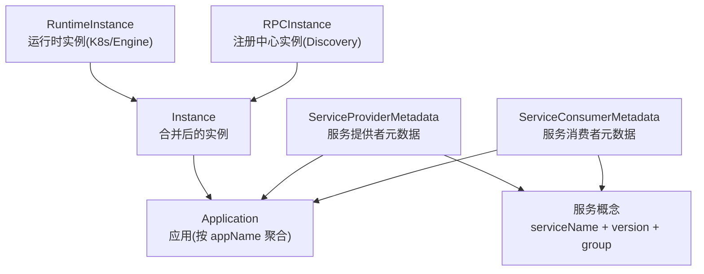

# dubbo-admin 解析

> [!abstract]
> 这篇笔记主要梳理 Dubbo Admin 里几个最容易混淆的概念：应用、服务、实例，以及它们在项目中的真实实体和关系。

## 一句话先记住

在这个项目里：

- `应用`、`服务` 是业务视角
- `RuntimeInstance`、`RPCInstance`、`Instance` 是实例视角
- 其中 `Instance` 才是控制台里真正拿来展示“实例页”的主实体

## 一张图看整体关系

## 1. 实例相关概念

### RuntimeInstance

`RuntimeInstance` 表示运行时里的实例，来源是 K8s / Engine。

可以近似理解成：

- 一个 Pod
- 或者一个实际运行中的工作负载实例

它更关心运行时信息，例如：

- `ip`
- `rpcPort`
- `image`
- `workloadName`
- `workloadType`
- `node`
- `probes`

所以它回答的问题是：

> 这个东西在运行环境里是怎么跑的？

### RPCInstance

`RPCInstance` 表示注册中心里的实例，来源是 Discovery。

可以近似理解成：

- 一个注册出去的实例地址
- 或者一个被服务发现系统看到的 RPC 实体

它更关心注册信息，例如：

- `ip`
- `port`
- `protocol`
- `registerTime`
- `serialization`
- `endpoints`

所以它回答的问题是：

> 这个东西在注册中心里是怎么被发现和调用的？

### Instance

`Instance` 是控制台中的统一实例，它是由 `RuntimeInstance` 和 `RPCInstance` 合并出来的。

你可以把它理解成：

- 给用户展示的“实例对象”
- 既带运行时信息，也带注册信息

所以实例页里看到的大多数信息，实际上都是从 `Instance` 来的，而不是直接看 `RuntimeInstance` 或 `RPCInstance`。

## 2. 应用相关概念

### Application

`Application` 表示逻辑应用，核心就是一个 `appName`。

它本身非常薄，主要只有：

- `name`
- `instanceCount`

所以它不是一个很重的领域对象，更像是：

- 一个应用索引
- 一个按 `appName` 聚合后的视图

### Application 和 Instance 的关系

一个 `Application` 下面会有多个 `Instance`。

也就是说：

- `Application` 回答“这是什么应用”
- `Instance` 回答“这个应用当前有哪些实例”

在控制台里，应用详情很多信息并不是直接存在 `Application` 里，而是：

1. 先按 `appName` 查出所有 `Instance`
2. 再把实例里的信息聚合成应用详情

比如：

- Dubbo 端口
- 镜像
- 协议
- workload

这些都是从实例汇总出来的。

## 3. 服务相关概念

### 这个项目里的“服务”到底是什么

在 Dubbo Admin 里，服务更接近：

- `serviceName`
- `version`
- `group`

也就是一条 Dubbo 服务身份。

所以平时说“一个服务”，在项目里通常指的是：

> `serviceName + version + group`

### ServiceProviderMetadata

`ServiceProviderMetadata` 表示：

- 哪个应用提供了哪个服务
- 这个服务有哪些方法
- 方法的参数和类型是什么

它把“服务”和“提供者应用”连接起来了。

所以它回答的问题是：

> 某个应用提供了哪些服务？某个服务的方法签名是什么？

### ServiceConsumerMetadata

`ServiceConsumerMetadata` 表示：

- 哪个应用消费了哪个服务

所以它回答的问题是：

> 某个服务被哪些应用消费？某个应用消费了哪些服务？

## 4. 页面到底在查什么

### 实例页

实例页主要看的是 `Instance`。

也就是说，控制台真正展示的“实例”是合并后的实例，不是原始的 K8s 实例，也不是原始的注册中心实例。

### 应用页

应用页入口虽然是 `Application`，但应用详情和应用下的实例列表，核心还是查这个 `appName` 下面的 `Instance`。

所以应用页本质上是：

- 先定位应用
- 再看这个应用对应的实例集合

### 服务页

服务页更依赖：

- `ServiceProviderMetadata`
- `ServiceConsumerMetadata`

而不是单独依赖 `Service` 这个资源本体。

所以你在服务页里看到的很多内容，本质上是：

- 服务和 provider app 的关系
- 服务和 consumer app 的关系

## 5. 最容易混淆的地方

### 误区 1：Application 和 Instance 是一回事

不是。

- `Application` 是逻辑应用
- `Instance` 是应用下面的运行/注册实例

关系更像：

- 一个应用
- 对应多个实例

### 误区 2：RuntimeInstance 就是实例页里的实例

也不是。

实例页里的实例主要是 `Instance`，而 `RuntimeInstance` 只是实例信息的一部分来源。

### 误区 3：RPCInstance 就是一个完整实例

不完全是。

`RPCInstance` 更偏注册中心视角，它描述的是注册出来的实例信息和端点信息。

控制台不会直接把它当最终实例给用户展示，而是会和 `RuntimeInstance` 合并成 `Instance`。

### 误区 4：服务和应用是一回事

不是。

- `应用` 是 `appName`
- `服务` 是 `serviceName + version + group`

一个应用可以提供多个服务，也可以消费多个服务。

## 6. 一个例子帮助理解

假设有一个应用 `shop-detail`：

- 它在 K8s 里有 2 个 Pod
- 它提供 `com.foo.DetailService`
- 这 2 个 Pod 都注册到了注册中心

那在这个项目里通常会出现：

- 1 个 `Application`
  - 名字是 `shop-detail`
- 1 条或多条 `ServiceProviderMetadata`
  - 表示 `shop-detail` 提供了 `com.foo.DetailService`
- 2 个 `RuntimeInstance`
  - 对应 2 个 Pod
- 2 个 `RPCInstance`
  - 对应注册中心里的 2 个地址
- 2 个 `Instance`
  - 是控制台合并后的 2 个实例

## 7. 最后用一句话收尾

如果从“看源码”的角度来记：

- 看应用：先想 `Application`，但要知道详情大多来自 `Instance`
- 看服务：优先想 `ServiceProviderMetadata` / `ServiceConsumerMetadata`
- 看实例：优先想 `Instance`
- 看 K8s 运行态：想 `RuntimeInstance`
- 看注册中心注册态：想 `RPCInstance`

---

关联阅读：

- [[Dubbo/Dubbo 学习记录]]
